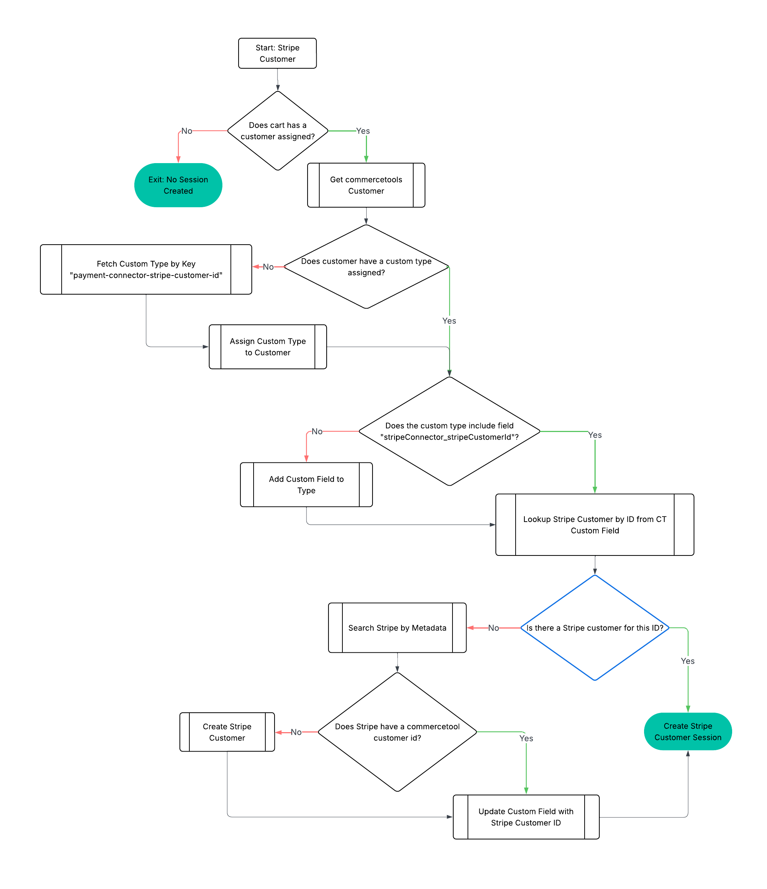

# Payment Integration Processor
This module provides an application based on [commercetools Connect](https://docs.commercetools.com/connect), which is triggered by HTTP requests from Checkout UI for payment operations.

The corresponding payment, cart or order details would be fetched from composable commerce platform, and then be sent to Stripe for various payment operations such as create/capture/cancel/refund payment.

The module also provides template scripts for post-deployment and pre-undeployment action. After deployment or before undeployment via connect service completed, customized actions can be performed based on users' needs.

## Considerations for Stripe Customer Session

The Stripe customer session allows you to create a session for a customer, which can be used to manage their payment methods and subscriptions. This feature is particularly useful for businesses that want to provide a seamless checkout experience for their customers.

The Stripe customer session is associated with the customer who owns the cart in the commercetools Checkout session. The cart must have the `customerId` associated to retrieve and verify if the customer has a Type with the custom field `stripeConnector_stripeCustomerId`. If the Type do not have this field, the connector will create the field to store the Stripe customer ID.

If the `stripeConnector_stripeCustomerId` is presented, the connector will try to retrieve the Stripe customer, if the customer do not exist on Stripe, the connector will create a new customer in Stripe using the customer who owns the cart in the session. The commercetools customer ID will be stored in the metadata of the Stripe customer and the `stripeConnector_stripeCustomerId` field in commercetools will be updated with the Stripe customer ID .

The environment variable `STRIPE_SAVED_PAYMENT_METHODS_CONFIG` configures the saved payment methods. The value needs to be a valid stringified JSON. More information about the properties can be found [here](https://docs.stripe.com/api/customer_sessions/object#customer_session_object-components-payment_element-features). This feature is disabled by default.

Diagram of the current workflow:



## TODO Considerations for subscription
TODO subscriptions only work with schedule based auth + auto capture. There isn't a "auth and capture later" scenario / pattern that exists with subscription payments


## Getting Started

These instructions will get you up and running on your local machine for development and testing purposes.
Please run following npm commands under `processor` folder.

#### Install PSP Stripe SDK
In case SDK is provided by payment service provider for communication purpose, you can import the SDK by following commands
```
$ npm install stripe
```
#### Install dependencies
```
$ npm install
```
#### Build the application in local environment. NodeJS source codes are then generated under dist folder
```
$ npm run build
```
#### Run automation test
```
$ npm run test
```
#### Run the application in local environment. Remind that the application has been built before it runs
```
$ npm run start
```
#### Fix the code style
```
$ npm run lint:fix
```
#### Verify the code style
```
$ npm run lint
```
#### ==Run post-deploy script in local environment==
```
$ npm run connector:post-deploy
```
#### Run pre-undeploy script in local environment
```
$ npm run connector:pre-undeploy
```

## Running application

Setup correct environment variables: check `processor/src/config/config.ts` for default values.

Make sure commercetools client credential have at least the following permissions:

* `manage_payments`
* `manage_checkout_payment_intents`
* `view_sessions`
* `introspect_oauth_tokens`
* 'view_api_clients'
* 'manage_orders'
* 'manage_types'

```
npm run dev
```

## Authentication

Some of the services have authentication mechanism.

* `oauth2`: Relies on commercetools OAuth2 server
* `session`: Relies on commercetools session service
* `jwt`: Relies on the jwt token injected by the merchant center via the forward-to proxy

### OAuth2
OAuth2 token can be obtained from commercetools OAuth2 server. It requires API Client created beforehand. For details, please refer to [Requesting an access token using the Composable Commerce OAuth 2.0 service](https://docs.commercetools.com/api/authorization#requesting-an-access-token-using-the-composable-commerce-oauth-20-service).

### Session
Payment connectors relies on session to be able to share information between `enabler` and `processor`.
To create session before sharing information between these two modules, please execute following request to commercetools session service
```
POST https://session.<region>.commercetools.com/<commercetools-project-key>/sessions
Authorization: Bearer <oauth token with manage_sessions scope>

{
  "cart": {
    "cartRef": {
      "id": "<cart-id>" 
    }
  },
  "metadata": {
    "allowedPaymentMethods": ["card", "ideal", ...],
    "paymentInterface"?: "<payment interface that will be set on payment method info https://docs.commercetools.com/api/projects/payments#ctp:api:type:PaymentMethodInfo>"
  }
}
```

Afterwards, session ID can be obtained from response, which is necessary to be put as `x-session-id` inside request header when sending request to endpoints such as `/operations/config` and `/operations/payments`.

### JSON web token (JWT)

`jwt` needs some workaround to be able to test locally as it depends on the merchant center forward-to proxy.

In order to make easy running the application locally, following commands help to build up a jwt mock server:

#### Set environment variable to point to the jwksUrl
```
export CTP_JWKS_URL="http://localhost:9000/jwt/.well-known/jwks.json"
```
#### Run the jwt server
```
docker compose up -d
```

#### Obtain JWT
```
# Request token
curl --location 'http://localhost:9000/jwt/token' \
--header 'Content-Type: application/json' \
--data '{
    "iss": "https://mc-api.europe-west1.gcp.commercetools.com",
    "sub": "subject",
    "https://mc-api.europe-west1.gcp.commercetools.com/claims/project_key": "<commercetools-project-key>"
}'
```
Token can be found in response
```
{"token":"<token>"}
```

Use the token to authenticate requests protected by JWT: `Authorization: Bearer <token>`.

### Merchant Return URL

The `MERCHANT_RETURN_URL` plays a key role during the payment confirmation process using [confirmPayment](https://docs.stripe.com/js/payment_intents/confirm_payment). This URL is used as the `return_url` parameter in the confirmation step.

For **Buy Now Pay Later (BNPL)** payment methods, Stripe appends the `payment_intent` to the return URL after the payment process is completed. Upon redirection to the merchant's site, the following steps are necessary to ensure proper integration with commercetools Checkout SDK:

1. Retrieve the `payment_intent` from the URL parameters.
2. Extract the `ct_payment_id` from the `payment_intent` metadata.
3. Use the `ct_payment_id` to update the `paymentReference` in the commercetools Checkout SDK to properly link the payment.

By implementing this workflow, seamless integration of BNPL payment methods with commercetools Checkout is achieved.

## APIs
The processor exposes the following endpoints to execute various operations with the Stripe platform:

### Configurations of collecting payment, appearance and future usage
This endpoint retrieves the payment information from the cart in session to use the prebuilt Stripe Payment Element UI component. This component simplifies the payment process for a variety of payment methods. The `paymentComponent` is requested in the query parameters to send the correct appearance from the environment variables configuration.

#### Endpoint
`GET /config-element/:paymentComponent`

#### Query Parameters
-**paymentComponent**: Used to retrieve the correct appearance of the selected payment method. The appearance can be modified in the environment variables `STRIPE_APPEARANCE_PAYMENT_ELEMENT` and should be in the form of a JSON string with escaped double quotes (e.g. {"theme":"night","labels":"floating"} ). The correct values will be retrieved by the exposed call ´operations/payment-components´, e.g., 'payment'.

#### Response Parameters
The response will provide the necessary information to populate the payment element:
- **cartInfo**: An object containing two attributes:
  - `amount`: Amount in cents for the cart in session.
  - `currency`: Currency selected for the cart in session.
- **appearance**: Optional. Used to customize or theme the payment element rendered by Stripe's prebuilt UI component. It must be a valid [Element Appearance](https://docs.stripe.com/elements/appearance-api).
- **captureMethod**: The current capture method configured in the payment connector.
- **setupFutureUsage**: The current setup future usage configured in the payment connector.[More information](https://docs.stripe.com/api/customer_sessions/object#customer_session_object-components-payment_element-features).
- **layout**: This configuration enables the Layout for the payment component. The value needs to be a valid stringified JSON. [More information](https://docs.stripe.com/payments/payment-element#layout).
- **collectBillingAddress**: This configuration enables the collection of billing address for the Stripe Payment Element component. The default value is 'auto'. [More information](https://docs.stripe.com/payments/payment-element#collecting-billing-address).

### Create Payment Intent from Stripe
This endpoint creates a new [payment intent](https://docs.stripe.com/api/payment_intents) in Stripe. It is called after the user fills out all the payment information and submits the payment. 
#### Endpoint
`POST /payments`

#### Query Parameters
N/A

#### Response Parameters
- **sClientSecret**: The client secret is used to complete the payment from your frontend. 
- **paymentReference**: The payment reference of the current process.
- **merchantReturnUrl**: The URL used as the `return_url` parameter in Stripe's [confirmPayment](https://docs.stripe.com/js/payment_intents/confirm_payment) process. After the payment confirmation, Stripe appends the `paymentReference` and `cartId` as query parameters to this URL. For Buy Now, Pay Later (BNPL) payment methods, this URL can be used to reinitialize the commercetools Checkout SDK. More information on implementing the return URL for BNPL payment methods can be found in the [commercetools Checkout SDK documentation](https://docs.commercetools.com/checkout/sdk#return-url).
- **cartId**: The cartId of the current proccess.
- **billingAddress**: The billing address provided by the merchant, which will be sent to Stripe during the `confirmPayment` process.

### Confirm the Payment Intent to commercetools

This endpoint creates a new [payment intent](https://docs.stripe.com/api/payment_intents) or [subscription](https://docs.stripe.com/api/subscriptions) in Stripe. It is called after the user fills out all the payment information and submits the payment. If the Cart contains a product that has a type of Subscription it will proceed with the subscription payment, if not it will create a normal payment intent.

#### Endpoint

`POST /confirmPayments/:id`

#### Query Parameters

- **id**: The payment reference of the current process.

#### Response Parameters

- **outcome:"approved|rejected"**: The response of the updated confirmation in commercetools payment transaction.

#### Diagram of the current Payment flow


### Webhook Listener

The webhook listener receives events from your Stripe account as they occur, allowing your integration to automatically execute actions accordingly. By registering webhook endpoints in your Stripe account, you enable Stripe to send [Event objects](https://docs.stripe.com/api/events) as part of POST requests to the registered webhook endpoint hosted by your application.
The available webhooks are configured on the `post-deploy.ts` file, and more webhook event can be added in the method `updateWebhookEndpoint`.
The conversion of the webhook event to a transaction is converted in hte `/src/services/converters/stripeEventConverter.ts` file.

The following webhooks currently supported and transformed to different payment transactions in commercetools are:

- **payment_intent.canceled**: Modified the payment transaction Authorization to Failure and create a payment transaction CancelAuthorization: Success
- **payment_intent.succeeded**: Creates a payment transaction Charge: Success. Create the order from the cart that has the payment referenced.
- **payment_intent.requires_action**: Logs the information in the connector app inside the Processor logs.
- **payment_intent.payment_failed**: Modify the payment transaction Authorization to Failure.
- **charge.refunded**: Create a payment transaction Refund to Success, and a Chargeback to Success.
- **charge.succeeded**: If the charge is not captured, create the payment transaction to Authorization:Success.
- **charge.captured**: Logs the information in the connector app inside the Processor logs.

### Order Creation

The order is created during the processing of the `payment_intent.succeeded` webhook. Before creating the order, the cart must include shipment information.

In the current implementation, the sample application retrieves shipment and address details from the `last_charge` attribute included in the Stripe event payload. This setup serves as an example and can be adapted or reused based on your specific requirements.

#### Endpoint
`POST /stripe/webhooks`

#### Request Parameters
The [Event object](https://docs.stripe.com/api/events) sent to your webhook endpoint provides a snapshot of the object that changed. These objects might include a `previous_attributes` property indicating the change, when applicable. This event is received as a raw string because Stripe requires the raw body of the request for signature verification.

#### Response Parameters
The endpoint returns a 200 response to indicate the successful processing of the webhook event.

### Apple pay well-know file
This endpoint return the string of the .well-know call domain [file from Stripe](https://stripe.com/files/apple-pay/apple-developer-merchantid-domain-association).

#### Endpoint
`GET /applePayConfig`

#### Query Parameters
N/A

#### Response Parameters
- **string**: The string value of the well-know domain file.

### Stripe customer session
Stripe customer session is used to manage the payment methods and subscriptions of a customer. This endpoint creates a new customer session in Stripe. It is called after the user fills out all the payment information and submits the payment. [More information](#considerations-for-stripe-customer-session). 

#### Endpoint
`GET /customer/session`

#### Query Parameters
N/A

#### Response Parameters
- **stripeCustomerId**: The ID of the customer in Stripe used for the session.
- **ephemeralKey**: The ephemeral key used to access the Stripe customer session.
- **sessionId**: The ID of the customer session in Stripe.

### Get supported payment components
Private endpoint protected by JSON Web Token that exposes the payment methods supported by the connector so that checkout application can retrieve the available payment components.

#### Endpoint
`GET /operations/payment-components`

#### Request Parameters
N/A

#### Response Parameters
The connector supports payment methods such as [Payment element](https://docs.stripe.com/payments/payment-element) embedded as a drop-in 

```
{
    dropins: [
        {
          type: 'embedded',
        },
    ],
    components: [],
}
```

### Get config
Exposes configuration to the frontend such as `publishableKey` and `environment`.

#### Endpoint
`GET /operations/config`

#### Request Parameters
N/A

#### Response Parameters
It returns an object with `publishableKey` and `environment` as key-value pair as below:
```
{
  environment: <environment>,
  publishableKey: <publishableKey>,
}
```

### Get status
It provides health check feature for checkout front-end so that the correctness of configurations can be verified.

#### Endpoint
`GET /operations/status`

#### Request Parameters
N/A

#### Response Parameters
It returns following attributes in response:
- status: It indicates the health check status. It can be `OK`, `Partially Available` or `Unavailable`
- message: Indicates the message.
- timestamp: The timestamp of the status request
- version: Current version of the payment connector.
- checks: List of health check result details. It contains health check result with various external system including commercetools composable commerce and Stripe payment services provider.
```
    [ 
        {
            name: <name of external system>,
            status: <status with indicator UP or DOWN>,
            message: <message>,
            details: <additional information for connection checking>,
        }
    ]
```
- metadata: It lists a collection of metadata including the name/description of the connector and the version of SDKs used to connect to external system.

### Modify payment
Private endpoint called by Checkout frontend to support various payment update requests such as cancel/refund/capture payment. It is protected by `manage_checkout_payment_intents` access right of composable commerce OAuth2 token.

#### Endpoint
`POST /operations/payment-intents/{paymentsId}`

